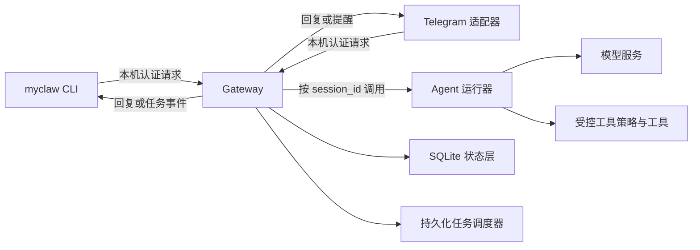

# MyClaw Gateway 与 CLI 架构说明

## 1. 决策与目标

第二阶段将项目改造为本机单用户的 Gateway 架构。

Gateway 是唯一持有 Agent、会话、任务、工具策略和运行状态的常驻服务。CLI 与 Telegram 都是 Gateway 的客户端，不直接创建 Agent，也不直接读写会话状态。

本阶段目标是实现 `myclaw` 命令和仅本机可访问的 Gateway MVP，不复刻官方 OpenClaw 的控制 UI、插件市场、远程设备节点、多租户或公网部署。

## 2. 组件职责

| 组件 | 负责什么 | 不负责什么 |
| --- | --- | --- |
| Gateway | 认证、会话路由、Agent 调用、工具策略、任务调度、状态读写、审计事件 | 直接读取终端输入或 Telegram 更新 |
| Agent 运行器 | 根据指定会话处理消息、调用模型和受控工具、生成回复 | 决定网络监听、保存渠道凭据、直接发送 Telegram 消息 |
| CLI | 解析用户命令，向 Gateway 发送本机请求，展示结果 | 直接创建 Agent、读取数据库、保存会话 |
| Telegram 渠道适配器 | 接收 Telegram 更新、执行白名单校验、将消息转发给 Gateway、发送 Gateway 回复 | 直接调用 Agent、直接读写会话或任务 |
| SQLite 状态层 | 事务化保存会话、消息、摘要和任务 | 调用模型、判断用户权限、发送消息 |
| 工具策略 | 按 Agent 或操作类型决定允许调用的工具 | 相信模型文字承诺而绕过程序校验 |

## 3. 调用方向



唯一允许的外部入口是 CLI 和渠道适配器向 Gateway 发出的认证请求。

以下调用方向禁止出现：

- CLI → Agent 运行器；
- CLI → SQLite 状态层；
- Telegram 适配器 → Agent 运行器；
- Telegram 适配器 → SQLite 状态层；
- Agent 运行器 → Telegram API；
- 工具 → 绕过 Gateway 直接修改会话或任务状态。

## 4. 会话与状态边界

每个请求都必须携带稳定的 `session_id`。

- 终端或 CLI 默认会话可使用 `local:default`。
- Telegram 私聊会话使用 `telegram:<chat_id>` 的格式，其中 `<chat_id>` 只保存在运行数据中，不写入公开文档或代码。
- Gateway 根据 `session_id` 读取和写入会话；不同会话之间不得共享消息历史、摘要或任务。
- Gateway 状态将逐步迁移到 SQLite。
- 当前 JSONL 会话和长期记忆属于旧数据；迁移前必须显式创建备份，不能在 Gateway 启动时静默覆盖或删除。

## 5. Gateway 的最小接口边界

Gateway MVP 计划提供以下本机接口：

| 接口 | 用途 | 是否需要 Gateway Token |
| --- | --- | --- |
| `GET /health` | 查询 Gateway 是否存活 | 是 |
| `GET /status` | 查询版本、运行状态和会话数量 | 是 |
| `POST /sessions/{session_id}/messages` | 向指定会话发送一条文字消息 | 是 |
| `GET /sessions` | 列出会话摘要，不返回敏感正文 | 是 |

接口的具体实现与字段校验将在后续步骤完成。现在只固定职责边界。

## 6. 安全规则

- Gateway 默认只监听 `127.0.0.1`，不监听局域网或公网地址。
- 所有 Gateway 接口都需要本机 Gateway Token；Token 只保存在 Git 忽略的本机配置中。
- Telegram Bot Token、模型 API Key、Gateway Token、会话正文、长期记忆和日志不得提交 Git。
- 所有入站消息都是不可信输入，包括来自白名单用户的消息。
- 模型只能申请工具调用；Gateway 与工具策略必须在代码层面完成最终校验。
- Gateway 不可用时，CLI 和 Telegram 必须明确报错，不能绕过 Gateway 直接调用 Agent。

## 7. 运行生命周期

第一版 Gateway 以前台进程运行：

```text
myclaw gateway run
```

CLI 使用 Gateway：

```text
myclaw gateway status
myclaw chat
myclaw sessions list
```

Telegram 适配器作为另一个进程运行，但它只连接 Gateway。

服务安装、开机自启、远程访问、控制 UI 和多个 Gateway 配置文件不属于第二阶段 MVP。

## 8. 迁移原则

1. 每次只迁移一个职责：先命令入口，再状态层，再 Gateway，再渠道。
2. 每次迁移前先保留旧入口，直到新入口通过测试。
3. 不在同一次改动中同时修改状态格式、渠道逻辑和工具逻辑。
4. 所有状态迁移都需要成功验证、失败验证和自动化测试。
5. 任何涉及真实凭据的验证仅使用本机忽略配置，不写入测试、文档或 Git。

## 9. 8.1 验收结论

本架构确定以下核心规则：

- Gateway 是唯一的 Agent、会话、任务和副作用协调者。
- CLI 和 Telegram 都是 Gateway 客户端。
- 每个请求必须由 `session_id` 隔离。
- Gateway 先本机监听并要求 Token。
- 当前项目会渐进迁移，不进行一次性重写。